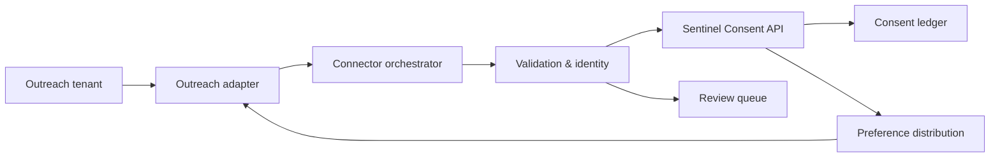
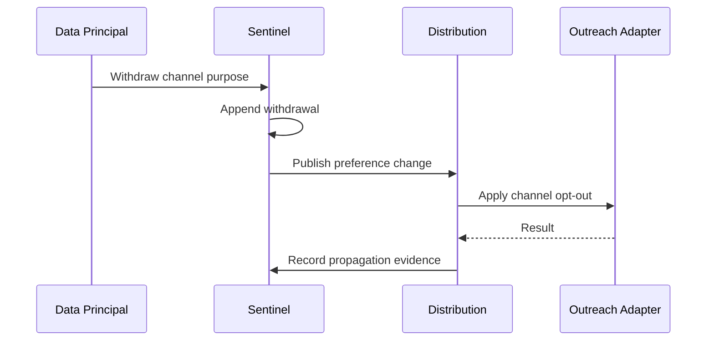

# Outreach → Sentinel Consent Connector

## Architecture and API Specification

**Document version:** 1.0  
**Date:** 2026-08-03  
**Status:** Proposed  
**Owner:** Sentinel Privacy Platform Engineering  

## 1. Purpose

This specification defines a secure, auditable integration between Outreach and Sentinel Consent Management. It covers the ingestion of eligible communication preferences and consent evidence, identity matching, channel-specific suppression, withdrawal distribution, auditability, security, operations, and production acceptance.

Sentinel is the authoritative consent and preference ledger. Outreach is a source of explicit prospect preference changes and a downstream enforcement point where supported. Email delivery, opens, clicks, replies, sequence enrollment, calls, meetings, and other engagement activity are not consent.

Official implementation references:

- [Outreach REST API](https://developers.outreach.io/api)
- [Outreach OAuth](https://developers.outreach.io/api/oauth)
- [Outreach webhooks](https://developers.outreach.io/api/webhooks)
- [Outreach Prospect resource](https://developers.outreach.io/api/reference/prospect)
- [Outreach granular opt-out guidance](https://support.outreach.io/support/solutions/articles/159000425885-enabling-granular-opt-out-in-outreach)

## 2. Scope and authority model

In scope:

- OAuth-based tenant authorization and least-privilege access.
- Historical and incremental Prospect/preference synchronization.
- Webhook ingestion with polling and reconciliation as safety nets.
- Explicit email, call, SMS, and global opt-out processing.
- Approved explicit opt-in evidence from versioned fields or objects.
- Identity resolution, mapping, validation, deduplication, and quarantine.
- Sentinel-to-Outreach or Sentinel-to-CRM withdrawal propagation.
- Immutable history, evidence hashes, operational monitoring, and audit reporting.

Out of scope:

- Inferring consent from engagement activity.
- Ingesting message bodies, call transcripts, recordings, or meeting content by default.
- Treating an opt-out reversal as fresh consent without affirmative evidence.
- Treating opt-out as erasure or as completion of a Data Principal rights request.
- Using undocumented Outreach endpoints or browser scraping.

## 3. Roles and responsibilities

| Actor or system | Responsibility |
|---|---|
| Data Principal | Gives, refuses, or withdraws an authorized channel preference. |
| Outreach Administrator | Authorizes the application, scopes access, and configures granular opt-out. |
| Client Privacy Owner | Approves purposes, notices, legal basis, mappings, and retention. |
| Outreach Adapter | Encapsulates OAuth, JSON:API resources, pagination, limits, and writeback. |
| Connector Orchestrator | Runs synchronization, webhook processing, retries, and reconciliation. |
| Identity Service | Resolves a Prospect to exactly one Sentinel Data Principal. |
| Validation Service | Qualifies consent evidence and preference changes. |
| Sentinel Consent API | Appends immutable events and derives current state. |
| Distribution Service | Applies withdrawals to Outreach or the authoritative CRM. |
| Review Queue | Holds ambiguous, incomplete, or conflicting records. |

## 4. Logical architecture



Use OAuth 2.0 authorization-code access for tenant installation. Store tokens only in an approved secret manager. Prefer narrowly scoped webhooks; use incremental polling and scheduled reconciliation to recover missed or delayed changes.

## 5. Supported data and consent treatment

| Outreach object or event | Sentinel treatment |
|---|---|
| Prospect ID and approved contact fields | Identity input; minimize and hash where possible. |
| Email, call, or text opt-out with timestamp | Channel-specific withdrawal or suppression event. |
| Explicit opt-in field with complete evidence | Consent candidate subject to validation. |
| Unsubscribe event | `WITHDRAWN` or `OPTED_OUT` for the mapped email purpose. |
| Manual representative opt-out | Withdrawal if actor, timestamp, channel, and source evidence exist. |
| Sequence enrollment or task creation | Operational activity only; never consent. |
| Email sent, delivered, opened, or clicked | Engagement only; never consent. |
| Reply, call, or meeting activity | Engagement only; never consent. |
| Call-recording consent | Separate purpose requiring explicit evidence and jurisdiction rules. |
| Custom object or field | Candidate only under an approved, versioned mapping profile. |

Consent, channel preference, legal basis, suppression state, and Data Principal rights requests must remain distinct.

## 6. Consent qualification and precedence

A new consent grant requires all of the following:

- Exactly one resolved Data Principal.
- A specific mapped purpose and channel.
- A clear affirmative action.
- The consent statement or its immutable hash.
- Privacy notice ID, version, and language.
- Source timestamp and collection context.
- Source object/event reference and integrity hash.
- A mapping profile approved by the client Privacy Owner.

An opt-out requires a reliable subject, channel or global scope, timestamp, source reference, and event integrity evidence. When evidence is incomplete, quarantine the record; never create a grant.

Precedence rules:

1. Apply the most restrictive current state immediately.
2. A newer valid withdrawal overrides an older grant.
3. An older source event cannot reverse a withdrawal.
4. Clearing an opt-out field does not prove renewed consent.
5. Conflicting events with uncertain ordering enter quarantine.

## 7. Granular preference mapping

| Outreach preference | Sentinel purpose example | Sentinel state |
|---|---|---|
| Email opted out | `SALES_OUTREACH_EMAIL` | Withdrawn / suppressed |
| Calls opted out | `SALES_OUTREACH_CALL` | Withdrawn / suppressed |
| Text opted out | `SALES_OUTREACH_SMS` | Withdrawn / suppressed |
| Global opt-out | All mapped sales channels | Withdrawn / suppressed per channel |

When granular opt-out is disabled, a global opt-out must suppress every configured Outreach communication channel. The connector must not invent channel-level permission.

## 8. Adapter and Sentinel APIs

Sentinel-owned internal adapter contract:

```http
GET   /adapter/v1/outreach/capabilities
GET   /adapter/v1/outreach/prospects?cursor={cursor}&updatedAfter={time}
GET   /adapter/v1/outreach/prospects/{prospectId}
GET   /adapter/v1/outreach/events?cursor={cursor}&updatedAfter={time}
POST  /adapter/v1/outreach/webhooks/verify
PATCH /adapter/v1/outreach/prospects/{prospectId}/preferences
```

Public operational endpoints:

| Method and path | Purpose |
|---|---|
| `POST /api/v1/connectors/outreach/configurations` | Create configuration. |
| `POST /api/v1/connectors/outreach/configurations/{id}/authorize` | Begin OAuth authorization. |
| `GET /api/v1/connectors/outreach/configurations/{id}/oauth/callback` | Complete OAuth with state validation. |
| `POST /api/v1/connectors/outreach/configurations/{id}/test` | Test tenant, scopes, resources, and write capability. |
| `POST /api/v1/connectors/outreach/configurations/{id}/sync` | Start historical or incremental synchronization. |
| `POST /api/v1/connectors/outreach/configurations/{id}/reconcile` | Compare preference state. |
| `POST /api/v1/connectors/outreach/webhooks/{configurationId}` | Receive tenant notifications. |
| `GET /api/v1/connectors/outreach/jobs/{jobId}` | Return job status and redacted failures. |
| `GET /api/v1/connectors/outreach/quarantine` | List tenant-scoped exceptions. |

The adapter translates Outreach resources into stable Sentinel contracts; these paths do not assert Outreach endpoint names.

## 9. Canonical event model

```json
{
  "schemaVersion": "1.0",
  "tenantId": "tenant_01J7",
  "externalConsentId": "outreach:org-01:event-9842",
  "idempotencyKey": "OUTREACH:org-01:event-9842:sha256-...",
  "dataPrincipal": {
    "sentinelId": "dp_01J7",
    "sourceSubjectId": "prospect-10492",
    "identityMatchMethod": "VERIFIED_EMAIL_HASH"
  },
  "source": {
    "system": "OUTREACH",
    "tenantReference": "org-01",
    "objectType": "PROSPECT_PREFERENCE",
    "objectId": "prospect-10492",
    "eventId": "event-9842"
  },
  "purpose": {
    "purposeId": "SALES_OUTREACH_EMAIL",
    "legalBasis": "CONSENT"
  },
  "consent": {
    "status": "WITHDRAWN",
    "channel": "EMAIL",
    "occurredAt": "2026-08-03T20:15:00Z"
  },
  "evidence": {
    "method": "OUTREACH_UNSUBSCRIBE",
    "sourceReference": "outreach:prospect-10492:event-9842",
    "payloadHash": "sha256:..."
  },
  "mapping": {
    "profileId": "outreach-map-01",
    "version": "1.0.0"
  }
}
```

For a grant, also include the consent statement/hash, notice ID and version, language, affirmative action, and collection context.

## 10. Ingestion, webhook, and reconciliation flow

1. An Outreach administrator authorizes Sentinel with minimum required scopes.
2. Sentinel confirms tenant identity and registers required webhooks.
3. The receiver authenticates delivery, validates schema/size, prevents replay, and queues a tenant-scoped envelope.
4. A worker retrieves the authoritative resource where necessary.
5. The connector minimizes, maps, qualifies, and resolves identity.
6. Sentinel appends the event using a stable idempotency key.
7. Ambiguous or incomplete items enter quarantine without creating a grant.
8. Incremental polling uses a timestamp overlap window or opaque cursor.
9. Daily reconciliation identifies missed events and state drift.

Checkpoint advancement occurs only after every item is accepted, deduplicated, or durably quarantined.

## 11. Withdrawal distribution



Distribution results are `APPLIED`, `ALREADY_APPLIED`, `FAILED_RETRYABLE`, `FAILED_PERMANENT`, or `NOT_SUPPORTED`. If CRM is the preference master, distribute through the approved CRM path and reconcile Outreach afterward. Pause or remove affected sequence participation where supported and required by policy.

## 12. Security, privacy, and audit controls

- Request only necessary OAuth scopes.
- Validate OAuth `state`, exact redirect URI, PKCE where supported, and tenant identity.
- Encrypt refresh tokens using tenant-scoped keys and revoke them on disconnect.
- Restrict webhook subscriptions and prevent replay.
- Use TLS 1.2+ and mTLS/private connectivity where required.
- Enforce tenant isolation in queues, storage, encryption context, and authorization.
- Exclude tokens, contact details, message bodies, raw payloads, and recordings from logs.
- Hash or tokenize email and phone identifiers where feasible.
- Maintain append-only consent history and evidence hashes.
- Log authorization, configuration, mapping, synchronization, quarantine, reversal, reconciliation, and writeback actions.
- Apply retention, purpose limitation, data minimization, and access controls approved by the client.

## 13. Error handling and observability

| Condition | Handling |
|---|---|
| Rate limit or temporary outage | Exponential backoff with jitter; retain checkpoint. |
| Expired token | Refresh once; fail closed and alert if unsuccessful. |
| Missing OAuth scope | Stop affected operation and alert administrator. |
| Duplicate event | Return existing result through idempotency. |
| Invalid or incomplete evidence | Quarantine; never create a grant. |
| Ambiguous identity | Quarantine; never auto-merge. |
| Permanent writeback failure | Record failure, alert, and retain withdrawal in Sentinel. |

Monitor synchronization lag, webhook failure rate, queue depth, quarantine rate, reconciliation drift, propagation latency, token failures, and retry exhaustion without exposing personal data.

## 14. Verification matrix

| Test | Expected result |
|---|---|
| Explicit email unsubscribe | Email purpose is withdrawn and auditable. |
| Granular call opt-out | Call is suppressed; email/SMS remain unchanged. |
| Global opt-out without granular mode | All mapped channels are suppressed. |
| Email open or link click | Rejected as `NOT_CONSENT`. |
| Sequence enrollment | No consent event is created. |
| Opt-in field without notice version | Quarantined or stored as non-authoritative preference. |
| Duplicate webhook | No duplicate ledger event. |
| Missed webhook | Poll/reconciliation recovers the change. |
| Sentinel withdrawal | Outreach or CRM updates and evidence is recorded. |
| Older opt-in after withdrawal | Withdrawn state remains effective. |
| Opt-out reversal without evidence | No new grant is created. |
| OAuth scope removed | Connector fails closed and does not advance checkpoint. |
| Ambiguous identity | Quarantined with no automatic merge. |

## 15. Implementation inputs

1. Outreach organization and sandbox identifiers.
2. Approved OAuth application, redirect URIs, and exact scopes.
3. Sample Prospect, preference, webhook, custom-field, and unsubscribe records.
4. Confirmation of granular opt-out settings.
5. Identity-key priority and collision rules.
6. Purpose, notice, language, and channel mapping profile.
7. Direct Outreach writeback versus CRM-master decision.
8. Sequence, retry, reconciliation, retention, and alert policies.
9. Call-recording consent requirements, if applicable.

## 16. Responsibility matrix

| Responsibility | Client | Sentinel team |
|---|---:|---:|
| Approve purpose and legal basis | Accountable | Consulted |
| Configure Outreach and OAuth access | Accountable | Support |
| Define identity and field mappings | Approve | Implement |
| Operate consent ledger | — | Accountable |
| Configure CRM/Outreach suppression | Shared | Shared |
| Define retention and rights handling | Accountable | Implement controls |
| Monitor reconciliation and failures | Shared | Shared |

## 17. Definition of done

The connector is production-ready when it:

- Passes OAuth, tenant-isolation, security, privacy, replay, retry, and disaster-recovery tests.
- Completes historical import and incremental synchronization with resumable checkpoints.
- Proves end-to-end email, call, SMS, and global withdrawal behavior as configured.
- Demonstrates that no engagement event can create a consent grant.
- Reconciles Sentinel with Outreach or the authoritative CRM.
- Produces complete, personal-data-minimized audit evidence.
- Meets agreed synchronization and propagation service objectives.
- Has approved operational runbooks, ownership, alerts, and rollback procedures.

